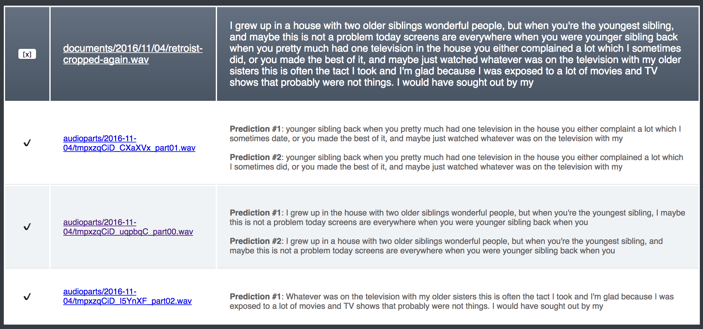

# Transcroobie
Transcroobie is an in-progress application for transcribing audio files using Amazon Mechanical Turk and Google's Speech API.

## Why
Following the example of [Soylent](http://projects.csail.mit.edu/soylent/), we predict that Transcription will be faster, cheaper, and more efficient if it's done in two steps: one Turker finds errors in the existing transcription, and another fixes these errors. We iterate until no errors are found.

## Journey of an audio snippet
First, the audio snippet is cut into 32-second chunks (with 2 second overlaps at the end of each snippet).
Each chunk is sent to Google for an initial prediction.
This prediction is forwarded to AMT to find any mistakes, and the fix/verify iteration begins up to three times.
The final prediction combines each of the snippets, taking account the overlapping region.

## Key files
[hitrequest/views.py](hitrequest/views.py)): The main controller for uploading audio and spawning/managing jobs.

[hitrequest/createHits.py](hitrequest/creatHits.py)): Creating, managing, and processing results from AMT HITs.

[hitrequest/overlap.py](hitrequest/overlap.py)): The algorithm for combining overlapping audio transcription (a simple optimization to find the maxima of the convex function).

## Security
For security, only the authors have access to login.

## Short-term to-do list
- Create interface for dealing with mulitple speakers
- Prevent the same Turker from touching the same audio snippet multiple times
- Pay Turkers based on whether their Fixed HIT was Verified by the next Turker

## Getting started
Create a .env file with the following keys:
```
export AWS_ACCESS_KEY_ID=""
export AWS_SECRET_ACCESS_KEY=""
export AWS_STORAGE_BUCKET_NAME=""
export AWS_S3_HOST=""

export DJANGO_SECRET_KEY=""
export DATABASE_URL=""

export I_AM_IN_DEV_ENV=""
export USE_AMT_SANDBOX=""

export GS_ACCESS_KEY_ID=""
export GS_SECRET_ACCESS_KEY=""
export GS_BUCKET_NAME=""

export REDIS_URL=""

export SOCIAL_AUTH_GOOGLE_OAUTH2_KEY=""
export SOCIAL_AUTH_GOOGLE_OAUTH2_SECRET=""
```
(and create all relevant accounts)

## Screenshot

